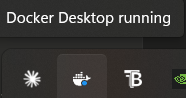

# Code Compiler 101

A browser-based C++ compiler with a code editor, powered by a Node.js backend that compiles and runs code inside Docker containers.

---

## 🗂️ Project Structure

```
├── index.html       # Main UI
├── style.css        # Layout and styling
├── script.js        # Editor init + fetch logic
├── server.js        # Express API (/compile endpoint)
├── package.json     # Backend dependencies
└── Dockerfile       # Alpine + g++ image for compilation
```

---

## ⚙️ How It Works

1. The user writes C++ code in the browser (CodeMirror editor).
2. Clicking **Run** sends the code via `POST /compile` to the Express backend.
3. The backend writes the code to a temporary `.cpp` file.
4. A Docker container (`frolvlad/alpine-gxx`) compiles and executes the file.
5. The output (or compiler error) is returned to the browser and displayed in the console panel.

---

## 🚀 Getting Started

### Prerequisites

- [Node.js](https://nodejs.org/) v18+
- [Docker](https://www.docker.com/) (must be running)

### Installation

```bash
# Clone the repository
git clone https://github.com/your-username/code-compiler-101.git
cd code-compiler-101

# Install backend dependencies
npm install

# Pull the Docker image used for compilation
docker pull frolvlad/alpine-gxx
```

### Running the Backend

```bash
node server.js
```

The server starts on `http://localhost:3000`.

### Running the Frontend

Open `index.html` directly in your browser, or serve it with any static file server:

```bash
npx serve .
```

### Starting Docker Desktop

Must install the Docker Desktop app and have it running in the background 

---

## 📡 API

### `POST /compile`

Compiles and runs a C++ code snippet.

**Request body:**
```json
{
  "language": "cpp",
  "code": "#include <iostream>\nint main() { ... }"
}
```

**Response:**
```json
{
  "output": "Hello, World!\n"
}
```

On compiler error, `output` contains the stderr from `g++`.

---

## 🐳 Docker

The project uses `frolvlad/alpine-gxx` from Docker Hub to compile C++ in an isolated container. The `Dockerfile` in this repo is an **alternative local image** using `alpine + g++` — it is not used by the backend by default.

To build and use the local image instead, update the `dockerImage` variable in `server.js`:

```js
// server.js
const dockerImage = "code-compiler-local"; // replace frolvlad/alpine-gxx
```

Then build it:

```bash
docker build -t code-compiler-local .
```

---

## 🛠️ Tech Stack

| Layer     | Technology                                      |
|-----------|-------------------------------------------------|
| Editor    | [CodeMirror 5](https://codemirror.net/5/)       |
| Frontend  | Vanilla HTML / CSS / JS                         |
| Backend   | [Node.js](https://nodejs.org/) + [Express 5](https://expressjs.com/) |
| Compiler  | g++ via [Docker](https://www.docker.com/)       |
| Icons     | Font Awesome, Devicon                           |

---

## ⚠️ Known Limitations

- Only **C++** is supported at this time. Other languages return `"Limbaj nesuportat momentan."`.
- No input (`stdin`) support — code that reads from `cin` will hang or fail.
- No execution timeout — a long-running program will block the Docker container indefinitely.
- Temporary `.cpp` files are written to the project root on the host machine.

---

## 🔮 Roadmap

- [ ] Support for more languages (Python, C, Java)
- [ ] `stdin` input field in the UI
- [ ] Execution timeout / resource limits on Docker containers
- [ ] File management (open, save, multiple tabs)
- [ ] AI assistant integration (Coming Soon in sidebar)

---

## 📄 License

MIT — do whatever you want with it.

---

*Created by Suciu Dinu Ștefan — December 2025*
